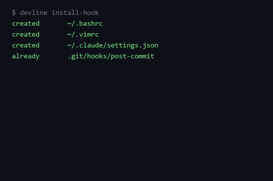

# devline — offline dev timeline

**Offline dev timeline: shell+editor+agent hooks into one SQLite file; ask what you did Friday.**



[](https://github.com/F0Rextasy/devline/actions/workflows/test.yml)
[](LICENSE)
[](https://github.com/F0Rextasy/devline/releases)
[](https://www.python.org)

## Install

```sh
pip install git+https://github.com/F0Rextasy/devline.git
```

No daemon, no account, no cloud — one SQLite file at `~/.devline/timeline.sqlite`.

## 30-second setup

1. Install the hooks (bash/zsh + PowerShell prompt, vim save, Claude Code tool-use, git commit):

```console
$ devline install-hook
created       ~/.bashrc
created       ~/.vimrc
created       ~/.claude/settings.json
created       .git/hooks/post-commit
$ echo $?
0
```

2. Work like you always do — every shell command is recorded with its exit
   code; file saves and agent tool calls land in the same table.

3. Ask what you did:

```console
$ devline friday
Friday 2026-09-25 — 2 events · 1 project · 0s tracked

12:17:58  shell  devline          pytest -q (exit 0)
12:17:58  shell  devline          git push origin main (exit 0)

by project:
  devline  2 events
```

`devline friday` defaults to the most recent Friday (today, if it is Friday);
`--date 2026-09-18` picks any day, `--json` feeds scripts. Exit code is always
0 — an empty day is an answer, not an error.

## Evidence, not vibes

Each line is a row you can audit: timestamp, source (`shell`/`editor`/`agent`),
command, project directory, **exit code**, optional duration (PowerShell hook
computes it from PSReadLine history).

```console
$ devline friday --json
{
  "date": "2026-09-25",
  "label": "Friday 2026-09-25",
  "summary": {
    "events": 2,
    "projects": 1,
    ...
```

Hooks are marker-guarded and idempotent — run `devline install-hook` twice and
everything reports `already`. `--dry-run` previews without writing. Existing
`~/.claude/settings.json` keys are merged, never replaced; an existing git
`post-commit` hook is preserved and appended to.

## Comparison

| | devline | ActivityWatch | WakaTime | grepping `$HISTFILE` |
|---|---|---|---|---|
| What it tracks | dev *work*: commands + exit codes + saves + agent calls | app/window focus | editor time | commands only |
| Storage | one SQLite file you own | SQLite daemon | cloud service | plaintext history |
| Hooks | shell, vim, Claude Code, git — no daemon | watch process | editor plugin | none |
| Ask "what did I do Friday" | built-in | manual queries | dashboard | you write the query |
| Offline | fully | mostly | needs account | fully |

Different category from trackers: devline is a **timeline with evidence**
(exit codes, project, source) you can quote in a standup or a postmortem —
which is exactly what people end up hand-rolling on HN (`PROMPT_COMMAND` +
`history` one-liners). This packages that, plus editor and agent hooks.

## Commands

| command | what it does |
|---|---|
| `devline install-hook [shell\|editor\|agent\|git\|all]` | install recording hooks, idempotent |
| `devline record --source shell --command …` | write one event (hooks call this) |
| `devline friday [--date …] [--json]` | timestamped evidence for a day |

`DEVLINE_DB` overrides the database path (tests, portable setups).

## Regenerate demo

```sh
python tools/render_demo.py   # runs the real CLI in a sandbox, rebuilds assets/
```

## Tests

```sh
python -m pytest -q    # 28 tests: hooks idempotency, JSON-merge safety, friday queries, CLI wiring
```

Live smoke on this machine: interactive bash with the installed rc → 3 events
recorded with exit codes → `devline friday` lists them.

## License

[MIT](LICENSE)
